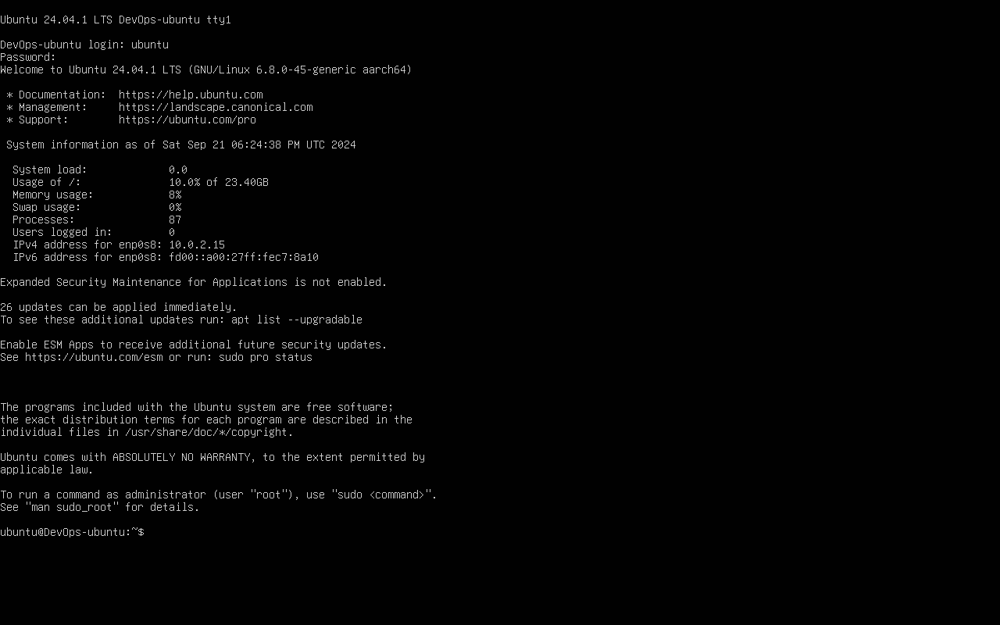

## Task 1

1. I installed Virtual Box from the website https://www.virtualbox.org/wiki/Downloads with version `7.1.0`.
   

2. Then, I installed ubuntu.
   

3. Add GUI.

```
sudo apt update
sudo apt install ubuntu-desktop
sudo reboot
```


4. Install VBox Guest Additions

## Task 2.1

1. Processor information

```
lscpu
```

**Output**

```
Architecture:             aarch64
  CPU op-mode(s):         64-bit
  Byte Order:             Little Endian
CPU(s):                   1
  On-line CPU(s) list:    0
Vendor ID:                0x00
  Model name:             -
    Model:                0
    Thread(s) per core:   1
    Core(s) per cluster:  1
    Socket(s):            -
    Cluster(s):           1
    Stepping:             0x0
    BogoMIPS:             48.00
    Flags:                fp asimd evtstrm aes pmull sha1 sha2 crc32 atomics fph
                          p asimdhp cpuid asimdrdm jscvt fcma lrcpc dcpop sha3 a
                          simddp sha512 asimdfhm dit uscat ilrcpc flagm ssbs sb
                          paca pacg dcpodp flagm2 frint
NUMA:
  NUMA node(s):           1
  NUMA node0 CPU(s):      0
Vulnerabilities:
  Gather data sampling:   Not affected
  Itlb multihit:          Not affected
  L1tf:                   Not affected
  Mds:                    Not affected
  Meltdown:               Not affected
  Mmio stale data:        Not affected
  Reg file data sampling: Not affected
  Retbleed:               Not affected
  Spec rstack overflow:   Not affected
  Spec store bypass:      Mitigation; Speculative Store Bypass disabled via prct
                          l
  Spectre v1:             Mitigation; __user pointer sanitization
  Spectre v2:             Not affected
  Srbds:                  Not affected
  Tsx async abort:        Not affected
```

2. RAM information

```
free -h
```

**Output**

```
               total        used        free      shared  buff/cache   available
Mem:           1.9Gi       1.0Gi        45Mi        40Mi       1.0Gi       928Mi
Swap:             0B          0B          0B
```

3. Network information

```
sudo apt-get install net-tools

ifconfig
```

**Output**

```
enp0s8: flags=4163<UP,BROADCAST,RUNNING,MULTICAST>  mtu 1500
        inet 10.0.2.15  netmask 255.255.255.0  broadcast 10.0.2.255
        inet6 fd00::b7dc:18df:2778:9515  prefixlen 64  scopeid 0x0<global>
        inet6 fd00::a00:27ff:fec7:8a10  prefixlen 64  scopeid 0x0<global>
        inet6 fe80::a00:27ff:fec7:8a10  prefixlen 64  scopeid 0x20<link>
        ether 08:00:27:c7:8a:10  txqueuelen 1000  (Ethernet)
        RX packets 27937  bytes 39983486 (39.9 MB)
        RX errors 0  dropped 0  overruns 0  frame 0
        TX packets 3806  bytes 248197 (248.1 KB)
        TX errors 0  dropped 0 overruns 0  carrier 0  collisions 0

lo: flags=73<UP,LOOPBACK,RUNNING>  mtu 65536
        inet 127.0.0.1  netmask 255.0.0.0
        inet6 ::1  prefixlen 128  scopeid 0x10<host>
        loop  txqueuelen 1000  (Local Loopback)
        RX packets 92  bytes 9679 (9.6 KB)
        RX errors 0  dropped 0  overruns 0  frame 0
        TX packets 92  bytes 9679 (9.6 KB)
        TX errors 0  dropped 0 overruns 0  carrier 0  collisions 0
```

## Task 2.2

Operating system specifications

```
uname -a
```

**Output**

```
Linux DevOps-ubuntu 6.8.0-45-generic #45-Ubuntu SMP PREEMPT_DYNAMIC Fri Aug 30 12:26:41 UTC 2024 aarch64 aarch64 aarch64 GNU/Linux
```
