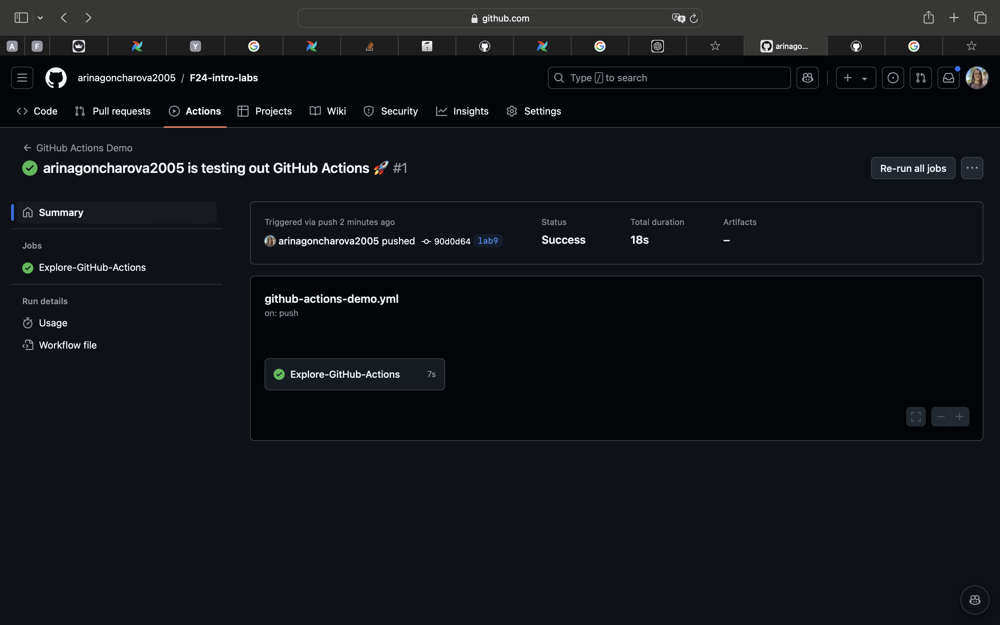

## Task 1

observations, key concepts, and steps

I followed the guide from the link: https://docs.github.com/en/actions/writing-workflows/quickstart.

1. Created directory `.github/workflows` and file `github-actions-demo.yml` inside it with the following content:

```
name: GitHub Actions Demo
run-name: ${{ github.actor }} is testing out GitHub Actions 🚀
on: [push]
jobs:
  Explore-GitHub-Actions:
    runs-on: ubuntu-latest
    steps:
      - run: echo "🎉 The job was automatically triggered by a ${{ github.event_name }} event."
      - run: echo "🐧 This job is now running on a ${{ runner.os }} server hosted by GitHub!"
      - run: echo "🔎 The name of your branch is ${{ github.ref }} and your repository is ${{ github.repository }}."
      - name: Check out repository code
        uses: actions/checkout@v4
      - run: echo "💡 The ${{ github.repository }} repository has been cloned to the runner."
      - run: echo "🖥️ The workflow is now ready to test your code on the runner."
      - name: List files in the repository
        run: |
          ls ${{ github.workspace }}
      - run: echo "🍏 This job's status is ${{ job.status }}."

```

3. Commited and pushed the directory to the branch lab9 on GitHub.

```
git add .github/
git commit -m "added directory"
git push origin lab9
```

4. Faced an error and modified settings of my terminal token.


5. Successfully pushed the changes.

The result was the following:



6. Then, I pushed new file `submission9.md` and workflow was runned automatically and successfully 🥳

```
git add .
git commit -m "Added some changes <0001f929>"
git push origin lab9
```


## Task 2

1. To add a manual trigger I modified the content of `github-actions-demo.yml` file.

The content became the following:

```
name: GitHub Actions Demo
run-name: ${{ github.actor }} is testing out GitHub Actions 🚀
on:
  - push
  - workflow_dispatch:
    inputs:
      logLevel:
        description: "Log level"
        required: true
        default: "warning"
        type: choice
        options:
          - info
          - warning
          - debug
      print_tags:
        description: "True to print to STDOUT"
        required: true
        type: boolean
      tags:
        description: "Test scenario tags"
        required: true
        type: string
      environment:
        description: "Environment to run tests against"
        type: environment
        required: true

jobs:
  Explore-GitHub-Actions:
    runs-on: ubuntu-latest
    steps:
      - run: echo "🎉 The job was automatically triggered by a ${{ github.event_name }} event."
      - run: echo "🐧 This job is now running on a ${{ runner.os }} server hosted by GitHub!"
      - run: echo "🔎 The name of your branch is ${{ github.ref }} and your repository is ${{ github.repository }}."
      - name: Check out repository code
        uses: actions/checkout@v4
      - run: echo "💡 The ${{ github.repository }} repository has been cloned to the runner."
      - run: echo "🖥️ The workflow is now ready to test your code on the runner."
      - name: List files in the repository
        run: |
          ls ${{ github.workspace }}
      - run: echo "🍏 This job's status is ${{ job.status }}."
```

2. Then I merged the `lab9` branch into `master` because in the documentation it was stated that workflow file should be on the default branch.
3. I tried to run trigger but the last input did not allow me to choose the text. In the task it was stated that inputs for manually triggered workflows are not needed, therefore I removed them.

With inputs:

Removed inputs from the `github-actions-demo.yml`.

```
name: GitHub Actions Demo
run-name: ${{ github.actor }} is testing out GitHub Actions 🚀
on:
  push:
    branches:
      - '**'

  workflow_dispatch:

jobs:
  Explore-GitHub-Actions:
    runs-on: ubuntu-latest
    steps:
      - run: echo "🎉 The job was automatically triggered by a ${{ github.event_name }} event."
      - run: echo "🐧 This job is now running on a ${{ runner.os }} server hosted by GitHub!"
      - run: echo "🔎 The name of your branch is ${{ github.ref }} and your repository is ${{ github.repository }}."
      - name: Check out repository code
        uses: actions/checkout@v4
      - run: echo "💡 The ${{ github.repository }} repository has been cloned to the runner."
      - run: echo "🖥️ The workflow is now ready to test your code on the runner."
      - name: List files in the repository
        run: |
          ls ${{ github.workspace }}
      - run: echo "🍏 This job's status is ${{ job.status }}."
```

Successfully triggered after removing inputs:


4. To get the runner, hardware specifications, and operating system information I modified the content of the `github-actions-demo.yml`.
   The content became the following:

```
name: GitHub Actions Demo
run-name: ${{ github.actor }} is testing out GitHub Actions 🚀
on:
  push:
    branches:
      - '**'

  workflow_dispatch:

jobs:
  Explore-GitHub-Actions:
    runs-on: ubuntu-latest
    steps:
      - run: echo "🎉 The job was automatically triggered by a ${{ github.event_name }} event."
      - run: echo "🐧 This job is now running on a ${{ runner.os }} server hosted by GitHub!"
      - run: echo "🔎 The name of your branch is ${{ github.ref }} and your repository is ${{ github.repository }}."
      - name: Check out repository code
        uses: actions/checkout@v4
      - run: echo "💡 The ${{ github.repository }} repository has been cloned to the runner."
      - run: echo "🖥️ The workflow is now ready to test your code on the runner."
      - name: List files in the repository
        run: |
          ls ${{ github.workspace }}
      - run: echo "🍏 This job's status is ${{ job.status }}."

      - name: Print runner information
        run: |
          echo "Runner OS: $RUNNER_OS"
          echo "Runner name: $RUNNER_NAME"
          echo "Runner version: $RUNNER_TRACKING_ID"

      - name: Print CPU information
        run: lscpu

      - name: Print memory information
        run: free -h

      - name: Print disk space information
        run: df -h

      - name: Print OS version information
        run: uname -a
```

### Gathered system information
